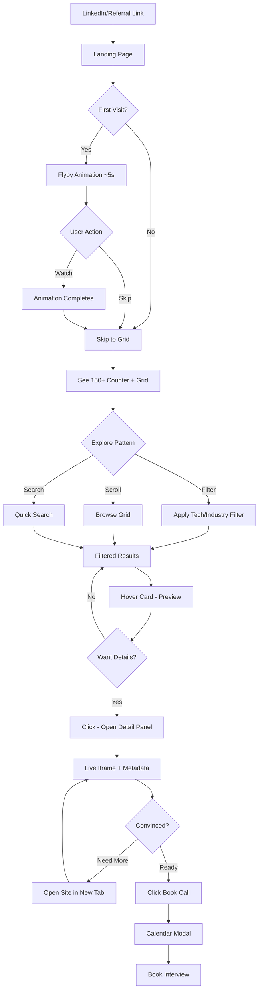
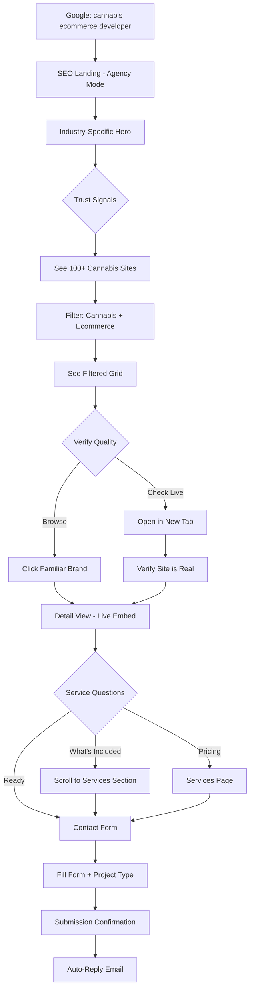
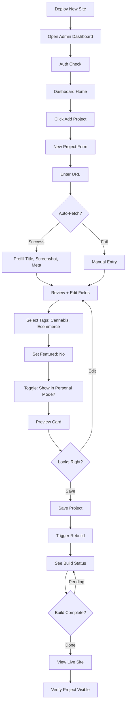

# UX Design Specification - Portfolio

**Author:** Cord Palmer
**Date:** 2026-03-30

---

## Executive Summary

### Project Vision

A dual-purpose portfolio that **proves capability rather than claiming it**. The site itself demonstrates every skill being showcased — React, animations, SEO, performance. 150+ production sites fly into view in a choreographed animation, then become explorable via live iframe embeds.

**Core Insight:** *The portfolio IS the proof.*

**Taglines:**
- Personal (cordpalmer.com): *Enterprise engineering. One person. Full stack.*
- Agency (swrv.tech): *Enterprise engineering. Global team. Full service.*

### Target Users

| Persona | Context | Goal | UX Priority |
|---------|---------|------|-------------|
| **Marcus** (Hiring Manager) | Evaluating candidates, seen 50 portfolios this week | Find a developer who can actually ship | Immediate impact, volume proof, live demos, easy booking |
| **Sarah** (Business Owner) | Frustrated with past agencies, midnight Googling | Find a dev partner who gets regulated industries | SEO discoverability, industry filtering, full-service messaging |
| **Cord** (Admin) | Just shipped a new site, wants to add it | Add/manage projects quickly | Structured data, fast deploys, minimal friction |

### Key Design Challenges

1. **The Flyby Animation** — Must be impressive without being annoying. Needs skip option, reduced motion respect, and fast path to content for returning visitors.

2. **150+ Project Scale** — Volume is the feature, but can't overwhelm. Needs smart filtering, progressive loading, and visual organization that communicates abundance without chaos.

3. **Live Iframe Embeds** — Cross-origin restrictions, loading states, performance impact. Needs graceful fallbacks and clear "open in new tab" escape hatch.

4. **Dual-Mode Toggle** — Switching between Personal and Agency modes must be obvious, not confusing. Content changes significantly — how do we signal this clearly?

5. **Mobile Experience** — Desktop animation doesn't translate. Need mobile-first alternative that preserves the "wow" without the performance cost.

### Design Opportunities

1. **Animation as Differentiator** — No other portfolio does this. The flyby can become signature, memorable, shareable.

2. **Volume as Visual Story** — The 150+ number tells a story. Design can amplify: counters, density visualization, "scroll to explore more" cues.

3. **Mode Toggle as Feature** — Make the Personal↔Agency switch a design moment, not just a button. It demonstrates React state management in action.

4. **Live Proof Pattern** — Interactive iframes let users verify claims in real-time. This builds trust faster than any testimonial.

---

## Core User Experience

### Defining Experience

**The ONE Thing:** Within 30 seconds, visitors must understand "this person has built 150+ production sites — and I can see them live."

The core loop is:
1. **See** → Flyby animation reveals scale
2. **Explore** → Filter and browse projects
3. **Verify** → Interact with live iframe embeds
4. **Convert** → Book a call or send inquiry

**Critical Interaction:** The transition from "see" to "explore" — when the animation settles and projects become interactive. This moment must feel seamless, not jarring.

### Platform Strategy

| Aspect | Decision | Rationale |
|--------|----------|----------|
| **Primary** | Web (responsive) | Portfolio = shareable links |
| **Priority** | Desktop-first design, mobile-essential | Hiring managers on laptops, clients on phones after-hours |
| **Input** | Mouse/keyboard primary, touch secondary | Hover states important (iframe preview) |
| **Offline** | Not required | Static content, Vercel CDN handles availability |
| **PWA** | Optional enhancement | "Add to homescreen" for mobile clients |

### Effortless Interactions

| Action | Should Feel Like | Implementation Hint |
|--------|------------------|---------------------|
| **Skip animation** | Instant, no penalty | "Skip to portfolio" visible immediately |
| **Filter projects** | Instantaneous | Client-side filtering, no loading states |
| **View live site** | Seamless embed | Iframe with smart loading, screenshot fallback |
| **Switch modes** | Delightful toggle | Smooth transition, URL updates |
| **Book a call** | One click | Calendar embed, no signup required |
| **Share a project** | Copy link | Deep links to each project |

### Critical Success Moments

| Moment | Success Indicator | Failure Mode |
|--------|-------------------|--------------|
| **Landing** | "Wow, this is different" | Bounces immediately |
| **Post-animation** | Starts scrolling/exploring | Confused, can't find content |
| **First iframe** | Clicks around live site | Iframe blocked, long load |
| **Industry filter** | "They've done lots of cannabis sites" | Can't find relevant work |
| **Decision point** | Clicks "Book a Call" | Can't find CTA, leaves |

### Experience Principles

1. **Proof Over Claims** — Every interaction should demonstrate capability, not just describe it. The site IS the resume.

2. **Volume Without Overwhelm** — Show abundance through density and animation, but never make navigation confusing. Smart defaults, powerful filters.

3. **Instant Verification** — Users should be able to verify any claim in < 3 seconds. Live site? One click. Tech stack? Visible. Portfolio quality? You're looking at it.

4. **Frictionless Conversion** — From "interested" to "booked call" should require exactly one click. No forms, no signup, no obstacles.

5. **Graceful Degradation** — Animation off? Still impressive. Iframe blocked? Screenshot works. Slow connection? Progressive loading. Every fallback should still impress.

---

## Desired Emotional Response

### Primary Emotional Goals

| Emotion | Target Audience | When It Hits |
|---------|-----------------|---------------|
| **Impressed** → "Damn, this is different" | All visitors | First 5 seconds (flyby) |
| **Confident** → "This person knows their stuff" | Marcus (Hiring Manager) | Exploring live sites |
| **Relieved** → "Finally, someone who gets it" | Sarah (Business Owner) | Seeing regulated industry work |
| **Empowered** → "I can verify everything myself" | All visitors | Interacting with iframes |
| **Decisive** → "I need to reach out NOW" | Converting visitors | CTA moment |

### Emotional Journey Mapping

| Stage | Marcus (Hiring Manager) | Sarah (Business Owner) |
|-------|-------------------------|------------------------|
| **Discovery** | Intrigued → "This email link better be good" | Hopeful → "Maybe this one won't suck" |
| **Landing** | Surprised → "Whoa, that animation" | Impressed → "This looks legit" |
| **Exploring** | Engaged → "Let me dig into these" | Reassured → "They've done cannabis before" |
| **Verifying** | Convinced → "These are real production sites" | Trusting → "This quality is what I need" |
| **Converting** | Urgent → "Book before someone else does" | Relieved → "Finally found the right partner" |
| **Post-visit** | Confident → "This one stands out" | Excited → "Can't wait to start" |

### Micro-Emotions

**Emotions to AMPLIFY:**

| Emotion | Design Trigger |
|---------|----------------|
| **Curiosity** | Animation hints at more below |
| **Validation** | Live sites prove claims |
| **Control** | Filters let visitors explore on their terms |
| **Delight** | Smooth transitions, attention to detail |
| **Status** | "I found a hidden gem before others" |

**Emotions to PREVENT:**

| Emotion | Risk Scenario | Mitigation |
|---------|---------------|------------|
| **Overwhelm** | 150 projects = chaos | Smart filtering, clear categories |
| **Impatience** | Slow animation, blocked iframes | Skip button, fallbacks |
| **Confusion** | Mode toggle unclear | Obvious visual differentiation |
| **Skepticism** | "Is this real?" | Live embeds prove authenticity |
| **Frustration** | Can't find relevant work | Industry filters, search |

### Design Implications

| Emotional Goal | UX Design Choice |
|----------------|------------------|
| **Impressed** | Choreographed GSAP animation, not random chaos |
| **Confident** | Real sites in iframes, not screenshots |
| **Relieved** | Industry filtering surfaces relevant work fast |
| **Empowered** | Visitors control exploration pace, skip options |
| **Decisive** | Single-click booking, always-visible CTA |

### Emotional Design Principles

1. **Proof Creates Confidence** — Don't tell visitors you're good; let them see and interact with proof. Every claim should be verifiable in one click.

2. **Respect Time, Reward Attention** — Offer escape hatches (skip animation) but reward those who stay (each second reveals something new).

3. **Competence Signals Competence** — The portfolio's polish proves attention to detail. Smooth animations = smooth code. Fast loading = performance expertise.

4. **Volume = Investment Proof** — 150+ sites signals years of dedication. Design should make this feel like an asset (abundance), not a liability (clutter).

5. **Conversion Should Feel Natural** — When someone is ready, the path to contact should feel organic, not pushy. CTA appears when intent is clear.

---

## UX Pattern Analysis & Inspiration

### Inspiring Products Analysis

#### 1. Linear (linear.app) — Technical Excellence as Brand

| Aspect | What They Do | Why It Works |
|--------|--------------|---------------|
| **Animation** | Silky smooth transitions, scroll-triggered reveals | Proves engineering quality through UX |
| **Dark Mode** | Default dark, gorgeous gradients | Signals "built by engineers, for engineers" |
| **Information Density** | Lots of info, never feels cluttered | Proves complex ≠ overwhelming |
| **Brand Voice** | Confident, minimal, no fluff | Lets quality speak for itself |

**Steal:** Animation as proof of capability. The experience IS the marketing.

#### 2. Vercel (vercel.com) — Live Deployment Showcase

| Aspect | What They Do | Why It Works |
|--------|--------------|---------------|
| **Hero** | Real deployments, live status | Proof happens above the fold |
| **Showcase Grid** | Customer sites as social proof | Volume = credibility |
| **Performance Focus** | Speed metrics, lighthouse scores | Technical claims backed by data |

**Steal:** Live proof pattern. Real metrics, real sites, no fake testimonials.

#### 3. Apple Product Pages — Choreographed Storytelling

| Aspect | What They Do | Why It Works |
|--------|--------------|---------------|
| **Scroll Animation** | Products reveal as you scroll | Curiosity drives engagement |
| **Pacing** | Each scroll = one new thing | Rewards attention, not speed |
| **Visual Hierarchy** | One giant thing at a time | Impossible to miss the point |

**Steal:** Flyby animation pacing. Each project screenshot should feel like a "reveal."

#### 4. Spotify Wrapped — Volume as Celebration

| Aspect | What They Do | Why It Works |
|--------|--------------|---------------|
| **Big Numbers** | "You listened to 50,000 minutes" | Scale creates emotional impact |
| **Personalization** | Your data, your story | Makes generic feel personal |
| **Shareable** | Designed to screenshot/share | Virality built into UX |

**Steal:** "150+ sites built" as a visual, shareable moment.

### Transferable UX Patterns

#### Navigation Patterns

| Pattern | Source | Apply To |
|---------|--------|----------|
| **Skip to content** | Any good accessible site | Skip animation option |
| **Sticky nav with scroll progress** | Linear | Long-scroll portfolio |
| **Filter chips** | E-commerce sites | Industry/tech filtering |
| **Mode toggle in nav** | GitHub (dark/light) | Personal ↔ Agency switch |

#### Interaction Patterns

| Pattern | Source | Apply To |
|---------|--------|----------|
| **Hover preview** | Netflix | Project card → shows iframe preview |
| **Pull to reveal** | iOS | Mobile flyby alternative |
| **Infinite scroll + lazy load** | Pinterest | 150+ project grid |
| **Deep link to items** | Any e-commerce | Direct project URLs |

#### Animation Patterns

| Pattern | Source | Apply To |
|---------|--------|----------|
| **Staggered entrance** | Linear | Flyby projects entering |
| **Scroll-triggered reveals** | Apple | Section transitions |
| **Smooth state transitions** | Stripe | Mode toggle animation |
| **Parallax layering** | Awwwards sites | Depth in flyby |

### Anti-Patterns to Avoid

| Anti-Pattern | Why It's Bad | Our Alternative |
|--------------|--------------|------------------|
| **Autoplay video with sound** | Immediate bounce | Animation is silent |
| **Unskippable intro** | Frustrates return visitors | Skip always visible |
| **Placeholder thumbnails** | Looks lazy | Real screenshots only |
| **Vague project descriptions** | No differentiation | Tech stack + outcome |
| **"Click to see more"** | Extra friction | Preview on hover |
| **Contact form with 10 fields** | Kills conversions | Calendar embed = 1 click |
| **Fake testimonials** | Erodes trust | Live sites = real proof |

### Design Inspiration Strategy

**ADOPT (use directly):**
- Linear's animation quality standard
- Vercel's live showcase approach
- Filter chips for project browsing
- Skip-to-content accessibility

**ADAPT (modify for our needs):**
- Apple scroll reveal → our flyby animation
- Spotify Wrapped big numbers → "150+ sites" hero
- Netflix hover preview → iframe on hover (but smaller)
- E-commerce filters → industry + tech + year

**AVOID (explicitly don't do):**
- Autoplay anything intrusive
- Dark patterns for contact capture
- Fake scarcity ("Only 2 slots left!")
- Generic stock photography

---

## Design System Foundation

### Design System Choice

**Selected:** shadcn/ui + Tailwind CSS

Components copied into codebase (not dependency). Full ownership and modification capability.

### Rationale for Selection

| Factor | shadcn/ui Advantage |
|--------|---------------------|
| **Ownership** | Components copied into your codebase, not a dependency. You own, you modify. |
| **Animation Ready** | Clean component primitives that work perfectly with GSAP/Framer Motion |
| **Dark Mode Native** | First-class dark mode support via CSS variables |
| **Radix Primitives** | Accessibility built-in (keyboard nav, ARIA, focus management) |
| **Tailwind Integration** | No framework clash. Design tokens → Tailwind config → shadcn themes |
| **No Bundle Bloat** | Import only what you use. Tree shaking works perfectly. |
| **Next.js Optimized** | Built with Next.js App Router in mind |

### Implementation Approach

**Phase 1: Foundation**
1. Initialize Tailwind CSS with design tokens
2. Install shadcn/ui CLI
3. Add base components: Button, Card, Dialog, Input, Popover
4. Configure dark/light themes with CSS variables

**Phase 2: Custom Components (Built on shadcn)**

| Component | Base | Customization |
|-----------|------|---------------|
| `ProjectCard` | Card | Hover → iframe preview |
| `FlybyAnimation` | Custom | GSAP-driven, no base |
| `ModeToggle` | Button | Personal ↔ Agency with animation |
| `FilterChips` | Toggle Group | Industry/tech filtering |
| `IframeEmbed` | Custom | Loading states, fallbacks |
| `CalendarEmbed` | Custom | Cal.com integration |

**Phase 3: Theme Tokens**
```css
/* Light mode */
--background: 0 0% 100%;
--foreground: 240 10% 3.9%;
--primary: /* brand color */

/* Dark mode (default) */
--background: 240 10% 3.9%;
--foreground: 0 0% 98%;
--primary: /* brand color */
```

### Customization Strategy

| Aspect | Strategy |
|--------|----------|
| **Typography** | Custom font (Inter or Geist) via Tailwind config |
| **Spacing** | Default Tailwind scale, extended for layout |
| **Colors** | Dark-first palette with brand accent |
| **Animations** | GSAP for hero, Framer Motion for micro-interactions |
| **Components** | shadcn base → extend for portfolio-specific needs |

### Components Needed (MVP)

| Category | Components |
|----------|------------|
| **Layout** | Container, Section, Grid, Nav, Footer |
| **Portfolio** | ProjectCard, ProjectGrid, ProjectDetail, IframeEmbed |
| **Interaction** | FilterChips, ModeToggle, ThemeToggle, SkipButton |
| **Contact** | ContactForm, CalendarEmbed |
| **Animation** | FlybyContainer, ScrollReveal, PageTransition |
| **UI** | Button, Badge, Dialog, Tooltip, Toast |

---

## Defining Experience

### The One Thing

**"150+ sites fly into view, then you can interact with them live."**

This is the moment users will describe to others:
- "His portfolio has this insane animation where all his projects fly across the screen..."
- "You can actually click into the sites and use them—they're real!"
- "It's not a portfolio, it's proof."

### The Experience in User Language

| User Type | How They'd Describe It |
|-----------|------------------------|
| Marcus | "Finally, a developer who doesn't just show 6 projects. I could see everything." |
| Sarah | "I clicked a site and it actually loaded. I was scrolling their live site." |
| Friend | "You gotta see this portfolio. The animation is nuts." |

### User Mental Model

**Coming From:** Traditional portfolios (6-10 static screenshots, tech lists)

**Expectation Shift:**

| What They Expect | What They Get |
|------------------|---------------|
| Grid of thumbnails | Choreographed animation → grid |
| Click for screenshot modal | Click for live iframe embed |
| "React, Node.js, etc." | Actually using a React site |
| "Great attention to detail" | Experiencing attention to detail |

**Mental Model Anchors:**
- Netflix: "I browse, I hover, I see preview"
- App Store: "Screenshots → but I want the real thing"
- LinkedIn: "Claims skills" → This proves them

### Success Criteria

| Criteria | Measurement | Target |
|----------|-------------|--------|
| **Impressive** | Time before user scrolls/interacts | < 5 seconds |
| **Not Annoying** | Skip button usage | Available but < 20% use it |
| **Volume Registered** | User notices "150+" | Explicit counter visible |
| **Trust Established** | Clicks iframe | > 50% of visitors |
| **Conversion Ready** | Finds CTA | < 30 seconds |

### Novel vs Established Patterns

| Aspect | Pattern Type | Implementation |
|--------|--------------|----------------|
| **Flyby Animation** | **NOVEL** | Custom GSAP choreography, never done quite like this |
| **Project Grid** | Established | Masonry/grid with filters (Pinterest, Dribbble) |
| **Live Iframes** | Novel application | Rare in portfolios, common in Vercel showcases |
| **Mode Toggle** | Established | Dark/light toggle pattern, applied to content |
| **Filter Chips** | Established | Standard e-commerce UX |
| **Skip Animation** | Established | Accessibility pattern, "Skip to content" |

**Novel Pattern Education:**
- Flyby: No education needed — it's passive. Watch, then interact.
- Iframes: Familiar from any "view site" experience. Text cue: "Interact with live site"

### Experience Mechanics

#### 1. Initiation (Landing)

```
User arrives → Animation begins automatically
├─ Skip button visible immediately (top-right or bottom-center)
├─ Reduced motion: Skip to grid directly
└─ Return visitor: Cookie check → option to skip
```

#### 2. Interaction (Flyby)

```
T+0s: First projects fly in from edges
T+1s: Counter starts: "1... 5... 20... 50..."
T+2s: Density builds, creates "wall" effect
T+3s: Projects begin to settle into grid positions
T+4s: "150+ sites built" locks in prominently
T+5s: Animation complete, grid is interactive
```

**User control:**
- Scroll: Can scroll at any point to accelerate
- Skip: Instant jump to completed grid state
- Click: Clicking any flying project pauses + shows that project

#### 3. Feedback (During & After)

```
During Animation:
├─ Counter provides progress feedback
├─ Visual density = "wow, there's a lot"
└─ Smooth 60fps = "this is polished"

After Animation:
├─ Grid is immediately interactive
├─ Hover shows preview (live or screenshot)
├─ Filter chips appear for exploration
└─ CTA becomes visible
```

#### 4. Completion (Exploration)

```
Animation Done → User in Control
├─ Filter by industry: Cannabis, E-commerce, SaaS...
├─ Click project → Detail panel or modal
├─ Iframe loads (or fallback screenshot)
├─ "Visit Live Site" button for new tab
└─ "Book a Call" CTA always visible
```

---

## Visual Design Foundation

### Color System

#### Theme Strategy: Dark-First with High Contrast

**Primary Palette (Dark Mode - Default)**

| Token | HSL | Use |
|-------|-----|-----|
| `--background` | `240 10% 3.9%` | Page background |
| `--foreground` | `0 0% 98%` | Primary text |
| `--card` | `240 10% 6%` | Card surfaces |
| `--card-foreground` | `0 0% 98%` | Card text |
| `--muted` | `240 5% 15%` | Subtle backgrounds |
| `--muted-foreground` | `240 5% 65%` | Secondary text |
| `--border` | `240 5% 15%` | Borders, dividers |
| `--accent` | `210 100% 50%` | Primary brand accent |
| `--accent-foreground` | `0 0% 100%` | Text on accent |

**Light Mode (Toggle)**

| Token | HSL | Use |
|-------|-----|-----|
| `--background` | `0 0% 100%` | Page background |
| `--foreground` | `240 10% 3.9%` | Primary text |
| `--card` | `0 0% 98%` | Card surfaces |
| `--muted` | `240 5% 96%` | Subtle backgrounds |

**Semantic Colors**

| Token | Dark | Light | Use |
|-------|------|-------|-----|
| `--success` | `142 76% 36%` | `142 76% 30%` | Success states |
| `--warning` | `38 92% 50%` | `38 92% 45%` | Warnings |
| `--destructive` | `0 84% 60%` | `0 84% 50%` | Errors, destructive |

### Typography System

#### Font Stack

| Role | Font | Fallback |
|------|------|----------|
| **Headings** | Geist Sans | Inter, system-ui |
| **Body** | Geist Sans | Inter, system-ui |
| **Code** | Geist Mono | JetBrains Mono, monospace |

#### Type Scale (Tailwind)

| Token | Size | Weight | Use |
|-------|------|--------|-----|
| `text-6xl` | 3.75rem | 700 | Hero "150+" counter |
| `text-5xl` | 3rem | 700 | Page titles |
| `text-4xl` | 2.25rem | 600 | Section headers |
| `text-2xl` | 1.5rem | 600 | Card titles |
| `text-xl` | 1.25rem | 500 | Subheadings |
| `text-base` | 1rem | 400 | Body text |
| `text-sm` | 0.875rem | 400 | Secondary text |
| `text-xs` | 0.75rem | 500 | Labels, badges |

#### Line Heights

| Content Type | Line Height |
|--------------|-------------|
| Headings | 1.1 - 1.2 |
| Body | 1.6 |
| UI Labels | 1.4 |

### Spacing & Layout Foundation

#### Base Unit: 4px

| Token | Value | Use |
|-------|-------|-----|
| `space-1` | 4px | Tight spacing |
| `space-2` | 8px | Default gap |
| `space-4` | 16px | Card padding |
| `space-6` | 24px | Section gaps |
| `space-8` | 32px | Large gaps |
| `space-12` | 48px | Section padding |
| `space-16` | 64px | Hero padding |
| `space-24` | 96px | Page sections |

#### Layout Grid

| Breakpoint | Columns | Max Width | Gutter |
|------------|---------|-----------|--------|
| Mobile | 4 | 100% | 16px |
| Tablet | 8 | 768px | 24px |
| Desktop | 12 | 1280px | 24px |
| Wide | 12 | 1440px | 32px |

#### Container Strategy

```css
.container {
  max-width: 1280px;
  margin: 0 auto;
  padding: 0 1rem; /* mobile */
}
@media (min-width: 768px) { padding: 0 1.5rem; }
@media (min-width: 1024px) { padding: 0 2rem; }
```

### Accessibility Considerations

| Requirement | Standard | Implementation |
|-------------|----------|----------------|
| **Contrast (normal text)** | WCAG AA 4.5:1 | All text passes |
| **Contrast (large text)** | WCAG AA 3:1 | Headings pass |
| **Focus indicators** | Visible | `ring-2 ring-accent` |
| **Reduced motion** | Respect preference | `prefers-reduced-motion` query |
| **Font sizing** | Scalable | All sizes in rem |
| **Touch targets** | 44x44px minimum | Buttons, links meet requirement |

#### Color Blindness Considerations

- Don't rely on color alone for meaning
- Icons + text accompany color states
- Test with Sim Daltonism or similar

---

## Design Direction Decision

### Design Directions Explored

#### Direction A: "Linear-Inspired Minimal"
- Full-width hero, generous whitespace, single-column flow
- Subtle, refined flyby — smooth cascade, not explosive
- Large cards with heavy drop shadows on hover
- "Quiet confidence" — quality speaks for itself

#### Direction B: "Vercel Showcase"
- Dense grid, horizontal scrolling sections
- Fast, snappy flyby — quick burst
- Compact cards, glassmorphism effect
- "Technical precision" — every pixel intentional

#### Direction C: "Apple Theatrical"
- Full-screen sections, scroll-hijacked storytelling
- Dramatic flyby — builds tension, then releases
- Minimal borders, product photography style
- "Premium experience" — this is an event

#### Direction D: "Developer Portfolio+"
- Traditional nav + content, but elevated
- Functional flyby — impressive but not dominant
- Clear info hierarchy, easy scanning
- "Best in class" — familiar pattern, exceptional execution

### Chosen Direction: Hybrid B+C "Volume Theater"

**"Technical Precision with Theatrical Moments"**

| Element | Source | Rationale |
|---------|--------|----------|
| **Overall Layout** | B (Vercel) | Dense grid maximizes 150+ project impact |
| **Hero/Flyby** | C (Apple) | Theatrical animation IS the differentiator |
| **Project Cards** | B (Vercel) | Compact, scannable, supports volume |
| **Navigation** | D (Portfolio+) | Familiar, doesn't compete with content |
| **Mode Toggle** | B (Vercel) | Prominent but functional |
| **Whitespace** | A (Linear) | Strategic breathing room despite density |

### Design Rationale

1. **Volume needs density** — Can't show 150+ with giant cards
2. **Flyby needs theater** — That's the "holy shit moment"
3. **Post-animation needs efficiency** — Users scanning, not reading
4. **Navigation needs to disappear** — Don't compete with content
5. **Mode toggle needs visibility** — Core differentiator

### Visual Hierarchy

```
[1] Flyby Animation (captures attention)
    ↓
[2] "150+ Sites Built" Counter (establishes scale)
    ↓
[3] Project Grid with Filters (enables exploration)
    ↓
[4] Featured Project Detail (proves quality)
    ↓
[5] About/Contact (converts interest)
```

### Implementation Approach

| Phase | Focus |
|-------|-------|
| **1. Structure** | Nav, container, grid layout |
| **2. Hero/Flyby** | GSAP animation, skip logic |
| **3. Project Cards** | Hover states, iframe preview |
| **4. Filtering** | Client-side filtering, URL state |
| **5. Detail View** | Modal or panel with iframe |
| **6. Contact** | Form + calendar embed |
| **7. Polish** | Transitions, loading states, accessibility |

---

## User Journey Flows

### Journey 1: Marcus (Hiring Manager)

**Context:** Evaluating candidates, seen 50 portfolios this week, wants proof of capability.



**Key Interactions:**

| Step | User Goal | UI Response |
|------|-----------|-------------|
| Landing | Assess quality immediately | Flyby hooks attention |
| Skip | Get to content fast | Instant grid reveal |
| Filter | Find relevant work | Client-side filtering, URL updates |
| Preview | Quick assessment | Hover shows screenshot + tags |
| Detail | Verify quality | Panel with live iframe |
| Convert | Take action | Persistent CTA, calendar integration |

---

### Journey 2: Sarah (Business Owner)

**Context:** Frustrated with past agencies, searching late at night for cannabis ecommerce help.



**Key Interactions:**

| Step | User Goal | UI Response |
|------|-----------|-------------|
| Search | Find industry expert | SEO-optimized landing |
| Verify | Confirm real experience | Live embeds, recognizable brands |
| Filter | See relevant work | Industry + type filtering |
| Evaluate | Understand services | Clear service messaging |
| Contact | Start conversation | Low-friction form |

---

### Journey 3: Cord (Admin)

**Context:** Just deployed a new cannabis site, wants to add it to portfolio quickly.



**Key Interactions:**

| Step | User Goal | UI Response |
|------|-----------|-------------|
| Add | Start new project | Single prominent button |
| Fetch | Minimize manual entry | URL → auto-populate metadata |
| Tag | Categorize properly | Multi-select with suggestions |
| Preview | Verify appearance | Real-time card preview |
| Deploy | Get it live | One-click deploy + status |
| Verify | Confirm it worked | Link to live view |

---

### Journey Patterns

**Pattern: Progressive Disclosure**
```
Grid Card (minimal) → Hover (preview) → Click (full detail) → New Tab (complete)
```

**Pattern: Default + Override**
```
Animation plays (default) → Skip button available (override) → Remember preference (respect)
```

**Pattern: Immediate Feedback**
```
Filter click → Instant results → URL updates → Shareable state
```

**Pattern: Graceful Fallbacks**
```
Try iframe → If blocked → Show screenshot → Always offer "Open in new tab"
```

---

### Flow Optimization Principles

| Principle | Implementation |
|-----------|----------------|
| **< 3 clicks to conversion** | Landing → Filter → Detail → Book Call |
| **Zero dead ends** | Every view has clear next action |
| **Escape hatches everywhere** | Skip animation, open in new tab, close modal |
| **Progressive engagement** | Passive browse → active filter → convert |
| **Mobile parity** | All journeys work on mobile (adapted, not blocked) |

---

## Component Strategy

### Design System Components (shadcn/ui)

| Component | Usage in Portfolio |
|-----------|-------------------|
| **Button** | CTAs, filter chips, actions |
| **Dialog** | Project detail modal |
| **Card** | Base for project cards |
| **Input** | Search, contact form |
| **Tabs** | Filter categories |
| **Toggle** | Theme switch |
| **Avatar** | About section |
| **Badge** | Tech tags, status indicators |
| **Skeleton** | Loading states |
| **Sheet** | Mobile navigation |
| **Form** | Contact, admin forms |
| **Toast** | Notifications |
| **Command** | Quick search (⌘K) |
| **Calendar** | Booking integration |

---

### Custom Components

#### FlybyHero

**Purpose:** Choreographed animation of 150+ project screenshots flying into grid formation

**States:**
- `loading` — Assets preloading
- `animating` — Screenshots in motion
- `settling` — Landing into grid positions
- `complete` — Animation finished, interactive
- `skipped` — User bypassed via skip button

**Variants:**
- Desktop: Full 3D flyby with depth
- Mobile: Simplified fade-in cascade

**Accessibility:**
- `prefers-reduced-motion` triggers instant grid reveal
- Skip button always visible and focusable
- Focus management on completion

```typescript
<FlybyHero
  projects={projects}
  duration={5000}
  onComplete={() => setShowGrid(true)}
  onSkip={() => setShowGrid(true)}
  reducedMotion="instant"
/>
```

---

#### ProjectCard

**Purpose:** Dense grid card with hover preview state

**Content:** Screenshot, title, tech badges, year

**States:**
- `default` — Static thumbnail
- `hover` — Shows iframe preview
- `focused` — Keyboard focus ring
- `loading` — Skeleton placeholder

**Variants:**
- `small` — Standard grid size
- `featured` — 2x size for highlighted projects

**Accessibility:**
- Focus ring visible
- Keyboard activation (Enter/Space)
- Alt text for all screenshots

```typescript
<ProjectCard
  project={project}
  variant="default"
  onPreviewHover={() => prefetchIframe()}
  onClick={() => openDetail(project)}
/>
```

---

#### LiveIframeEmbed

**Purpose:** Sandboxed iframe with intelligent fallback strategy

**Content:** Live website preview OR screenshot fallback

**States:**
- `loading` — Skeleton shown
- `ready` — Iframe loaded successfully
- `error` — Load failed
- `blocked` — X-Frame-Options prevents embedding

**Actions:**
- Open in new tab
- Refresh iframe
- Report broken embed

**Accessibility:**
- Title attribute describes content
- Loading state announced to screen readers

```typescript
<LiveIframeEmbed
  url={project.url}
  fallbackImage={project.screenshot}
  onError={() => showFallback()}
  loading={<Skeleton className="aspect-video" />}
/>
```

---

#### ModeToggle

**Purpose:** Switch between Personal (cordpalmer.com) and Agency (swrv.tech) modes

**Content:** Visual indicator of current mode

**Behavior:** Changes headline, CTA text, and visible projects

**States:**
- `personal` — Individual developer branding
- `agency` — SWRV Tech team branding

**Accessibility:**
- `aria-pressed` state
- Announces mode change to screen readers

```typescript
<ModeToggle
  mode={mode}
  onModeChange={setMode}
  personalLabel="Cord Palmer"
  agencyLabel="SWRV Tech"
/>
```

---

#### ProjectFilter

**Purpose:** Combined filter controls for Technology, Industry, Project Type

**Content:** Filter chips, active count, clear all button

**States:**
- Filter chips: `active` / `inactive`
- URL synced for shareability

**Variants:**
- Horizontal bar (desktop)
- Bottom sheet (mobile)

**Accessibility:**
- `aria-selected` on active filters
- Filter results count announced

```typescript
<ProjectFilter
  filters={activeFilters}
  onFilterChange={setFilters}
  projectCount={filteredCount}
  totalCount={totalCount}
/>
```

---

#### StatsCounter

**Purpose:** Animated counter displaying "150+ Sites Built"

**Content:** Number, label, optional breakdown

**States:**
- `initial` — Number at 0
- `counting` — Animating up
- `complete` — Final value displayed

**Variants:**
- Hero: Large, prominent placement
- Inline: Within content blocks

**Accessibility:**
- Static number in `aria-label` (no animation dependency)

```typescript
<StatsCounter
  value={150}
  suffix="+"
  label="Sites Built"
  duration={2000}
/>
```

---

#### ProjectDetailPanel

**Purpose:** Full project view with live embed and metadata

**Content:** Live iframe, tech stack, year, description, external links

**States:**
- `loading` — Content loading
- `open` — Panel visible
- `closing` — Exit animation

**Actions:**
- View live site (new tab)
- Previous/next project navigation
- Close panel

**Accessibility:**
- Focus trap while open
- Escape key closes
- Project name announced on open

```typescript
<ProjectDetailPanel
  project={project}
  onClose={closePanel}
  onNext={nextProject}
  onPrev={prevProject}
/>
```

---

### Component Implementation Strategy

**Foundation Layer (shadcn/ui):**
- Form controls, dialogs, layout primitives, utilities
- Installed via CLI, copied to codebase for customization

**Custom Layer (7 components):**
- Domain-specific components for portfolio functionality
- Built using shadcn/ui primitives and CSS variables

**Token Consistency:**
- All custom components use shadcn/ui CSS variables:
  - `--background`, `--foreground`
  - `--primary`, `--secondary`
  - `--muted`, `--accent`
  - `--destructive`, `--border`, `--ring`

**Motion Strategy:**
- **GSAP:** FlybyHero complex choreography
- **Framer Motion:** Micro-interactions, page transitions
- **CSS:** Hover states, simple transitions

---

### Implementation Roadmap

| Phase | Components | Rationale |
|-------|------------|-----------|
| **1. Core (MVP)** | ProjectCard, ProjectFilter, LiveIframeEmbed | Grid browsing is the core experience |
| **2. Hero** | FlybyHero, StatsCounter | "Wow factor" differentiation |
| **3. Detail** | ProjectDetailPanel, ModeToggle | Complete exploration flow |
| **4. Admin** | ProjectForm, BuildStatus, ProjectTable | Management capability |

---

## UX Consistency Patterns

### Button Hierarchy

| Level | Style | Usage | Example |
|-------|-------|-------|--------|
| **Primary** | Solid fill, high contrast | One per view, main CTA | "Book a Call", "Submit" |
| **Secondary** | Outline/border | Supporting actions | "Filter", "View More" |
| **Ghost** | Text only, no border | Tertiary actions, nav | "Skip", "Clear Filters" |
| **Destructive** | Red variant | Dangerous actions | "Delete Project" (admin) |
| **Icon** | Icon only, no text | Compact UI | Theme toggle, close, refresh |

**Button States:**
```
default → hover (+brightness) → active (pressed) → focus (ring) → disabled (50% opacity)
```

**Sizing:**
- `sm` — Filter chips, compact UI
- `default` — Standard actions
- `lg` — Hero CTAs

---

### Feedback Patterns

| Type | Color Token | Icon | Duration | Usage |
|------|-------------|------|----------|-------|
| **Success** | `--success` (green) | ✓ Checkmark | 3s auto-dismiss | Form submitted, project saved |
| **Error** | `--destructive` (red) | ✗ X mark | Persistent until fixed | Validation error, load failed |
| **Warning** | `--warning` (amber) | ⚠ Triangle | User dismiss | Iframe blocked, slow load |
| **Info** | `--primary` (blue) | ℹ Circle | 5s auto-dismiss | "Filters applied", "Mode changed" |

**Toast Position:** Bottom-right (desktop), bottom-center (mobile)
**Stacking:** Max 3 visible, oldest dismissed first

---

### Form Patterns

**Field States:**
```
default → focus (ring + label lift) → valid (green check) → invalid (red border + error text) → disabled (muted)
```

**Validation Timing:**
- Validate on blur (first interaction)
- Re-validate on change (after error shown)
- Never validate while typing

**Error Messages:**
- Inline, below field
- Specific: "Email required" not "Invalid input"
- Red text + icon

**Contact Form Structure:**
```
Name (required) → Email (required) → Project Type (optional select) → Message (required textarea) → Submit
```

---

### Navigation Patterns

**Desktop:**
- Fixed header (shrinks on scroll)
- Logo left, nav center, CTA + theme toggle right
- Mode toggle visible in header

**Mobile:**
- Fixed header (logo + hamburger)
- Sheet overlay from right
- Full-width nav items
- Mode toggle in sheet

**Active State:**
- Underline indicator for current page
- `aria-current="page"`

**Scroll Behavior:**
- Header hides on scroll down, shows on scroll up
- "Back to top" button after 2 viewport scrolls

---

### Modal & Overlay Patterns

**Project Detail Panel:**
- Opens from right (slide-in)
- 60% width desktop, 100% mobile
- Backdrop blur behind
- Close: X button, Escape key, backdrop click

**Focus Management:**
```
Open → trap focus inside → close → return focus to trigger
```

**Scroll Behavior:**
- Body scroll locked when open
- Panel content scrolls independently

**Mobile Sheet:**
- Full-screen takeover
- Swipe down to dismiss
- Handle bar indicator at top

---

### Loading & Empty States

**Skeleton Loading:**
- Match exact layout of content
- Subtle pulse animation
- 3 placeholder cards in grid

**Progressive Loading:**
```
Show skeleton → Load above-fold first → Lazy load rest → Replace skeletons
```

**Empty States:**

| Context | Message | Action |
|---------|---------|--------|
| No filter results | "No projects match these filters" | "Clear filters" button |
| No search results | "No projects found for '[query]'" | Suggest removing terms |
| Iframe blocked | "This site can't be embedded" | "Open in new tab" button |

---

### Filter & Search Patterns

**Filter Interaction:**
- Click to toggle (immediate feedback)
- URL updates (shareable state)
- Count badge shows results
- "Clear all" when any active

**Filter Visual:**
```
Inactive: outline → Active: solid fill with × icon
```

**Search (⌘K):**
- Opens command palette
- Searches: project names, tech tags, industries
- Shows 5 results max with keyboard nav
- Enter opens first result

**URL State:**
```
/projects?tech=react,nextjs&industry=cannabis&type=ecommerce
```

---

### Animation Patterns

| Context | Type | Duration | Easing |
|---------|------|----------|--------|
| Page transition | Fade + slide | 200ms | ease-out |
| Modal open | Slide + fade | 250ms | ease-out |
| Modal close | Fade | 150ms | ease-in |
| Hover reveal | Scale + fade | 150ms | ease-out |
| Filter apply | Instant | 0ms | — |
| Counter animate | Count up | 2000ms | ease-out |
| Flyby | Complex | 5000ms | custom |

**Reduced Motion:**
- All animations → instant state change
- Flyby → grid appears immediately
- Counters → show final value

---

### Accessibility Patterns

**Focus Indicators:**
- 2px ring, offset 2px
- Uses `--ring` color token
- Never remove, only style

**Keyboard Navigation:**
- Tab through interactive elements
- Arrow keys within filter groups
- Escape closes any overlay
- Enter/Space activates buttons

**Screen Reader:**
- Live regions for dynamic updates
- Clear labels on all inputs
- Skip link to main content
- Project count announced on filter

---

## Responsive Design & Accessibility

### Responsive Strategy

**Desktop (1024px+):**
- Full flyby animation with 3D depth
- 4-6 column project grid
- Side-by-side detail panel (60% width)
- Keyboard shortcuts visible (⌘K search)
- Hover previews with live iframes

**Tablet (768px - 1023px):**
- Simplified flyby (reduced particle count)
- 3 column project grid
- Full-screen detail panel
- Touch targets enlarged
- Swipe gestures for project navigation

**Mobile (320px - 767px):**
- No flyby — instant grid with fade-in cascade
- 2 column grid (1 column for cards with detail)
- Bottom sheet for detail panel
- Bottom navigation for filters
- Screenshot-first (no live iframes on mobile)

---

### Breakpoint Strategy

```css
/* Mobile-first approach */
:root {
  /* Base: Mobile */
}

/* Tablet */
@media (min-width: 768px) { }

/* Desktop */
@media (min-width: 1024px) { }

/* Large Desktop */
@media (min-width: 1440px) { }
```

| Breakpoint | Grid Columns | Flyby | Detail View |
|------------|--------------|-------|-------------|
| 320px+ | 2 | Off (cascade) | Bottom sheet |
| 768px+ | 3 | Simplified | Full screen |
| 1024px+ | 4 | Full 3D | Side panel |
| 1440px+ | 6 | Full 3D | Side panel |

**Tailwind Integration:**
```
sm: 640px, md: 768px, lg: 1024px, xl: 1280px, 2xl: 1536px
```

---

### Accessibility Strategy

**Target Compliance:** WCAG 2.1 Level AA

| Requirement | Implementation |
|-------------|----------------|
| **Color Contrast** | 4.5:1 minimum (text), 3:1 (large text, UI) |
| **Focus Indicators** | 2px ring, never removed |
| **Touch Targets** | 44x44px minimum |
| **Text Scaling** | Works at 200% zoom |
| **Motion** | Respects `prefers-reduced-motion` |
| **Screen Readers** | Semantic HTML, ARIA labels |

**Specific Considerations:**

1. **Flyby Animation** → Instant reveal for `prefers-reduced-motion`
2. **Live Iframes** → Title attribute, loading state announced
3. **Filter Results** → Live region announces count changes
4. **Project Grid** → Proper heading hierarchy, grid role
5. **Mode Toggle** → `aria-pressed` state, announced change

---

### Keyboard Navigation Map

| Key | Action |
|-----|--------|
| `Tab` | Move between interactive elements |
| `Enter/Space` | Activate focused element |
| `Escape` | Close modal/panel, clear search |
| `⌘K` / `Ctrl+K` | Open search |
| `←/→` | Navigate projects in detail view |
| `↑/↓` | Navigate search results |
| `/` | Focus search input |

---

### Testing Strategy

**Responsive Testing:**

| Method | Tools |
|--------|-------|
| Browser DevTools | Chrome, Safari, Firefox responsive modes |
| Real Devices | iPhone 13+, iPad, Android flagship |
| Cross-browser | BrowserStack for older browsers |

**Accessibility Testing:**

| Method | Tools |
|--------|-------|
| Automated | axe DevTools, Lighthouse CI |
| Screen Reader | VoiceOver (Mac/iOS), NVDA (Windows) |
| Keyboard | Full site navigation, no mouse |
| Color | Sim Daltonism, Stark contrast checker |

**Testing Checklist:**
- [ ] All interactive elements keyboard accessible
- [ ] Focus order logical
- [ ] No content lost at 400% zoom
- [ ] All images have alt text
- [ ] Form errors announced
- [ ] Animations disabled with reduced motion
- [ ] Contrast passes in both themes

---

### Implementation Guidelines

**Responsive Development:**
```typescript
// Use Tailwind's responsive utilities
<div className="grid grid-cols-2 md:grid-cols-3 lg:grid-cols-4 xl:grid-cols-6">

// Container queries for component-level responsive
<ProjectCard className="@container">
  <div className="@md:grid-cols-2">

// Avoid fixed pixel widths
width: 100%;         // ✓
max-width: 1200px;   // ✓
width: 800px;        // ✗
```

**Accessibility Development:**
```typescript
// Semantic HTML
<main id="main-content">
<nav aria-label="Main navigation">
<article aria-labelledby="project-title">

// Skip link
<a href="#main-content" className="sr-only focus:not-sr-only">
  Skip to content
</a>

// Live regions for dynamic content
<div aria-live="polite" aria-atomic="true">
  {filterCount} projects found
</div>

// Reduced motion
const prefersReducedMotion = useReducedMotion();
if (prefersReducedMotion) return <StaticGrid />;
```

**Image Optimization:**
```typescript
// Next.js Image with responsive sizes
<Image
  src={project.screenshot}
  alt={`Screenshot of ${project.title} website`}
  sizes="(max-width: 768px) 50vw, (max-width: 1024px) 33vw, 16vw"
  placeholder="blur"
/>
```

